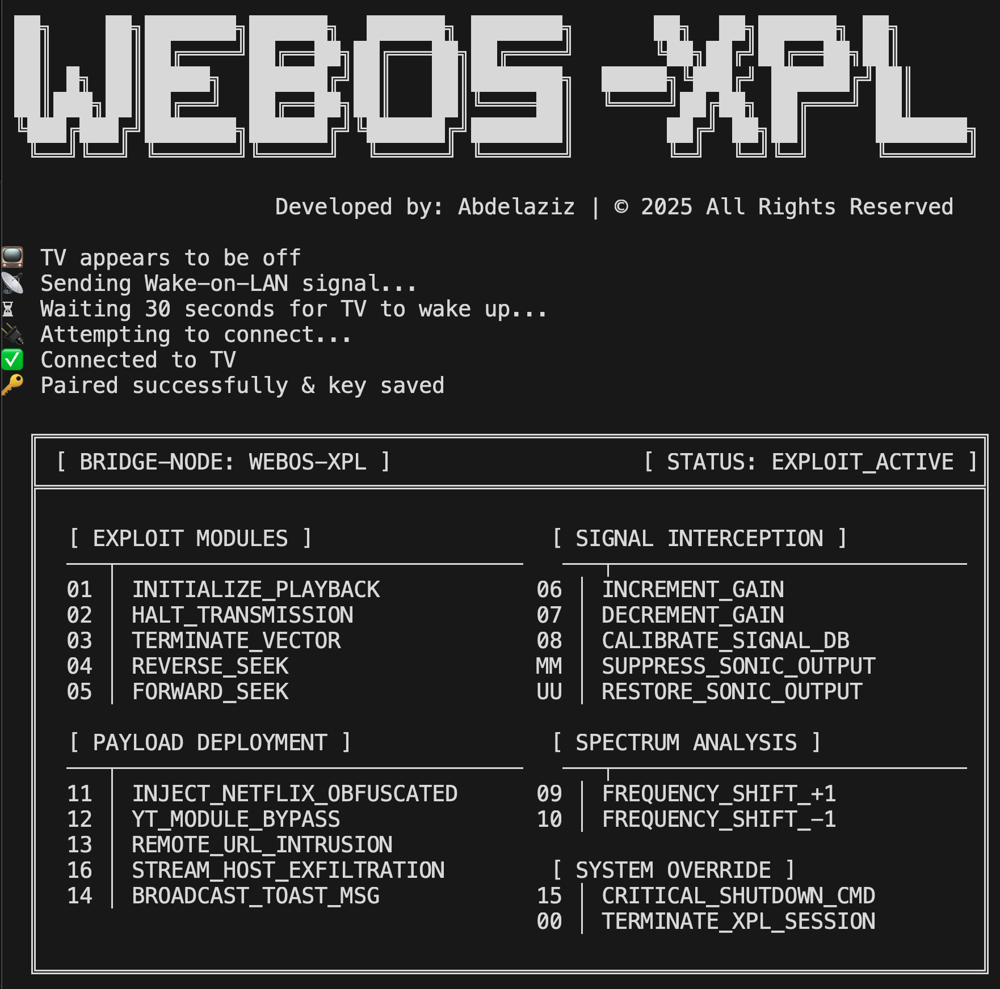

# WEBOS-XPL: Advanced WebOS Exploit Dashboard


## Secure Command & Control Interface for LG Displays

> [!IMPORTANT]
> **WEBOS-XPL** is a professional-grade command-line interaction suite designed for authorized network administration, display orchestration, and security auditing of LG WebOS-enabled systems.

---

## 🛠 Architectural Overview

WEBOS-XPL operates as a high-fidelity bridge between standard networking protocols and the proprietary LG WebOS Service Access Protocol (SSAP). By leveraging asynchronous websocket communication and localized broadcast frames, it provides a low-latency control vector for display management.

### Key Capabilities
- **WOL_VECTOR Execution**: Remotely initiate system boot sequences using persistent MAC address mapping.
- **Payload Orchestration**: Seamless injection of application manifests (Netflix, YouTube, Browser).
- **Signal Interception**: Real-time gain (volume) control and spectrum (channel) modulation.
- **System Override**: Full-authority remote shutdown and UI-layer notification injection.

---

## 🚀 Deployment Protocols

### Prerequisites
- **Runtime**: Go 1.20+ (Golang)
- **Connectivity**: Local Area Network (LAN) adjacency with the target node.
- **Authorization**: "LG Connect Apps" must be enabled on the target display.

### Installation
Clone the repository and initialize the dependency matrix:
```bash
go get github.com/gorilla/websocket
```

### Initial Handshake
The first connection requires a one-time cryptographic pairing. Supply the target IP and MAC address:
```bash
go run main.go 192.168.1.100 AA:BB:CC:DD:EE:FF
```
*Note: Your TV will prompt for authorization. Confirm to establish the secure bridge.*

### Automated Re-Entry
Once the initial session is established, persistent configuration allows for rapid re-entry using only the target IP:
```bash
go run main.go 192.168.1.100
```

---

## 🎮 Command Vector Matrix

| Code | Module | Operational Command |
| :--- | :--- | :--- |
| `01` | **CORE** | `INITIALIZE_PLAYBACK` |
| `02` | **CORE** | `HALT_TRANSMISSION` |
| `06` | **SIGNAL** | `INCREMENT_GAIN` |
| `MM` | **SIGNAL** | `SUPPRESS_SONIC_OUTPUT` |
| `11` | **PAYLOAD** | `INJECT_NETFLIX_OBFUSCATED` |
| `13` | **INTAKE** | `REMOTE_URL_INTRUSION` |
| `15` | **OVERRIDE** | `CRITICAL_SHUTDOWN_CMD` |

---

## ⚖️ Compliance & Security
This tool is intended for use by security professionals and system administrators. Usage against unauthorized targets is strictly prohibited. The developer assumes no liability for misuse or damage resulting from the operation of this suite.

**Developed by: Abdelaziz** | *© 2025 All Rights Reserved*
